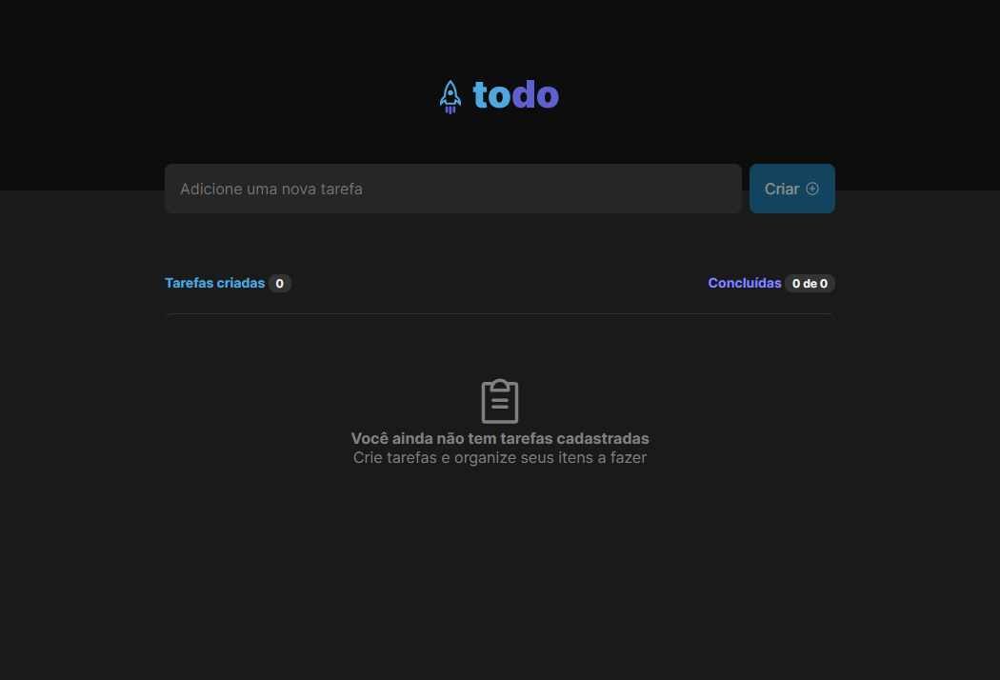

<div align="center">
  
</div>

## ToDo List

<h4 align="center">
  Podcastr is a platform built for podcast broadcasting.
</h4>



## Tecnologies
This project was developed using cutting edge front-end technologies.


- [ReactJS](https://reactjs.org/)
- [Typescript](https://www.typescriptlang.org/)
- [Next.js](https://nextjs.org/)

## 💻 Getting started

### Requirements

- You need to install both [Node.js](https://nodejs.org/en/download/) and [Yarn](https://yarnpkg.com/) to run this project.

**Clone the project and access the folder**

```bash
$ git clone https://github.com/andraderafa72/Podcastr.git && cd podcastr
```

**Follow the steps below**

```bash
# Install the dependencies
$ npm i

# Run the backend fake server
$ npm run server

# Run the web server
$ npm run dev
```

The app will be available for access on your browser at `http://localhost:3000`

## 📝 License

Made with 💜 by Rafael Andrade 👋 [Check out my LinkedIn](https://www.linkedin.com/in/andraderafa72)
